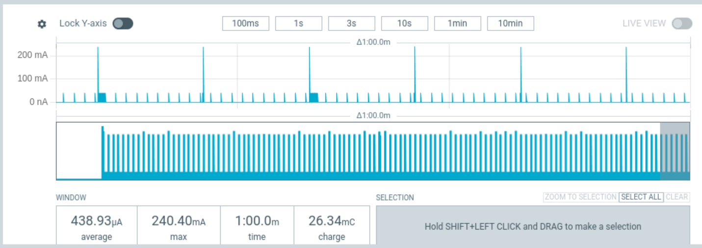
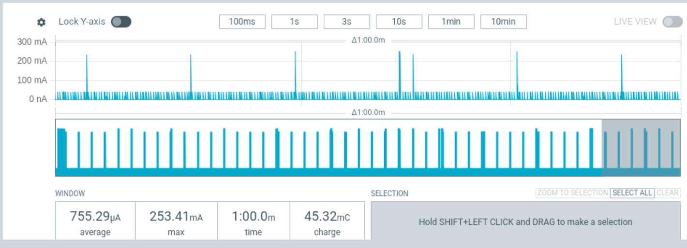

# Power Management Testing of esp32-c6 DFRobot Fire Beetle
Testing the external power_management component under multiple yaml configurations using the Nordic Semiconductor Power Profiler Kit II (PPK2)

* Test Date 2026-02-23
* EspHome Version: 2026.3.0-dev20260223
* DUT: ESP32-C6FH4 (QFN32) (revision v0.2) (esp32-c6 DFRobot Fire Beetle v1.2
* DUT Features: Wi-Fi 6, BT 5 (LE), IEEE802.15.4, Single Core + LP Core, 160MHz, Crystal frequency: 40MHz
* Power Supply: 3.3V pin

## Initial Test
The initial test to establish a baseline power profile over a 1 minute band.

```yaml
external_components:
  # [power_management] new component that enables power management for esp_idf
  - source: github://pr#12325
    components: [power_management]
    refresh: 1h
  # [openthread] Provide action to control radio on/off when poll_period > 0
  - source: github://pr#11766
    components: [openthread]
    refresh: 1h

esphome:
  name: test-esp32c6-1
  friendly_name: Test ESP32C6 1

esp32:
  #esp32-c6 Fire Beetle v1.2
  variant: esp32c6
  flash_size: 4MB
  framework:
    type: esp-idf
    log_level: NONE
    sdkconfig_options:
      #esp32-c6 Fire Beetle v1.2 has a 40Mhz external clock
      CONFIG_RTC_CLK_SRC_INT_RC: "n"
      CONFIG_RTC_CLK_SRC_EXT_CRYS: "y"

logger:
  level: NONE

network:
  enable_ipv6: true

power_management:
  enable_light_sleep: true
  power_down_flash: true
  power_down_peripherals: true
```
Test results in an average amperage of ~.07mA.  A pulse to 35mA occurs once per minute and is caused by the preferences component waking the chip up to store preferences in NVS.


## Add Open Thread Test
Add openthread component configure for Sleepy End Device at a poll_period of 10seconds.
Switch added for later use with api and mqtt to make it easier to access chip and is "OFF" for all testing

```yaml
openthread:
  device_type: mtd
  tlv: !secret openthread_tlv
  poll_period: 10sec

switch:
  - platform: template
    name: "Radio Always On"
    optimistic: true
    restore_mode: ALWAYS_OFF
    turn_on_action:
      then:
        - logger.log: "Radio Always On"
        - openthread.radio: true
    turn_off_action:
      then:
        - logger.log: "Radio Off When Idle"
        - openthread.radio: false
```

Test results in an average amperage of ~.5mA. A pulse to 35mA occurs once per second and is sourced in openthread task generating
a 1 second timer, further research needed to determine if there is a configuration of openthread that would stop this wakeup.



## Add API Test
Add api component

```yaml
api:
  encryption:
    key: !secret api_encryption_key
```

Test results in an average amperage of ~.75mA. Pulses to 35mA occur frequently around 5-7 times per second with short bursts to
higher occurance happening at least once per minute, further research needed to determine why api component is causing these wakeups.


