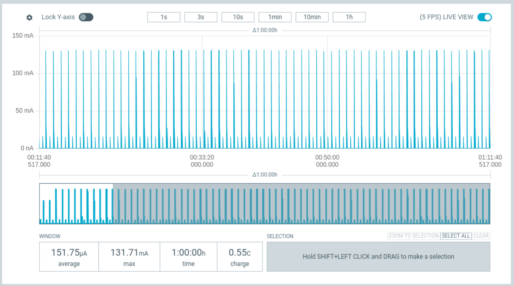
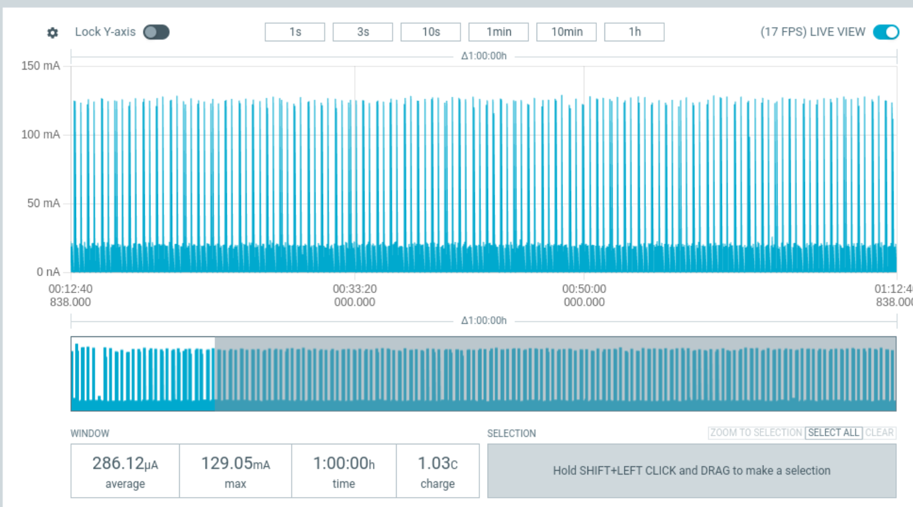
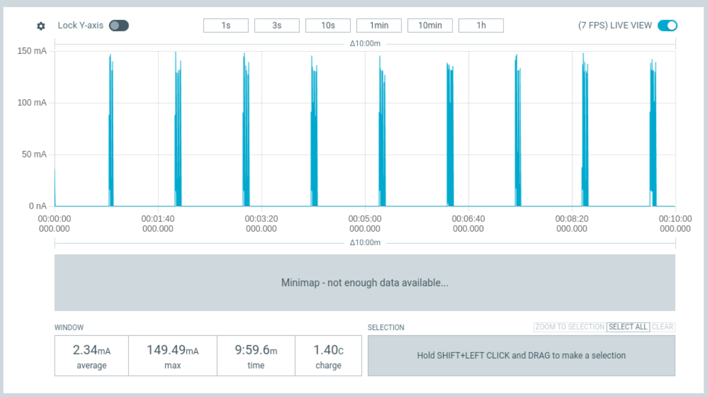
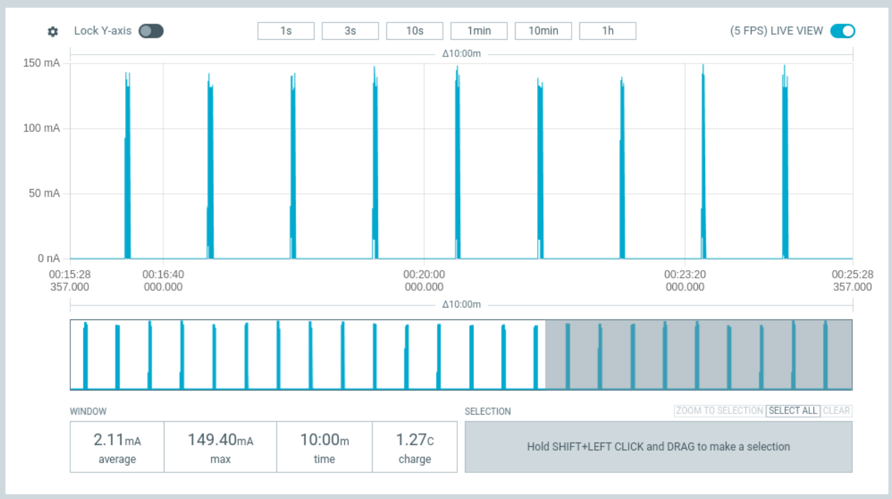
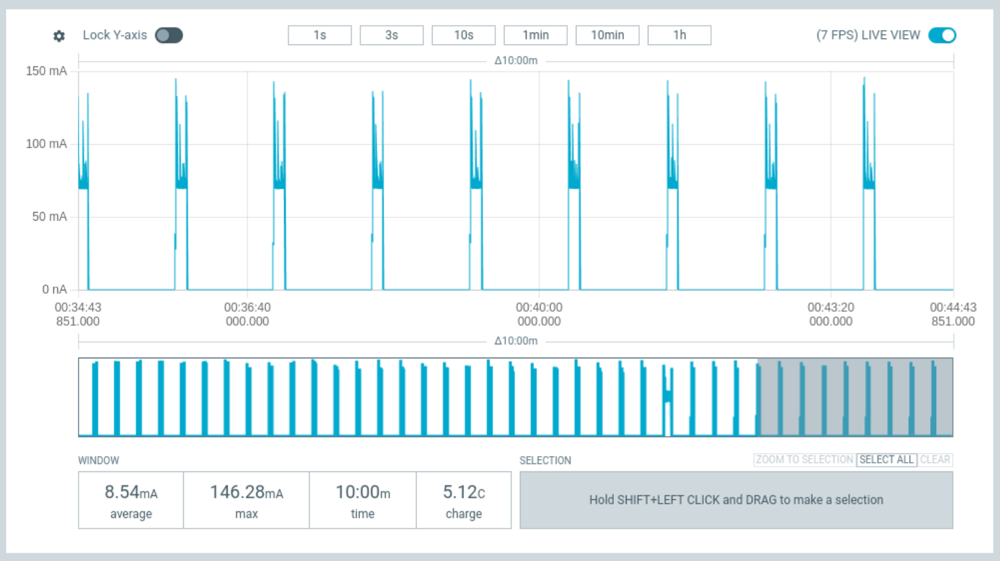
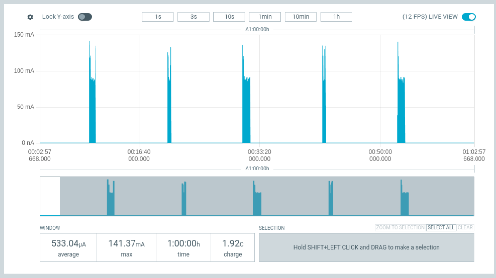

# Power Management Testing of esp32-c6 DFRobot Fire Beetle
Testing the external power_management component using the Nordic Semiconductor Power Profiler Kit II (PPK2)

## 2026-May-07

### Test Scenario

* Test Date 2026-05-07
* EspHome Dev, using esp-idf 6.0.1
* DUT: ESP32-C6FH4 (QFN32) (revision v0.2) (esp32-c6 DFRobot Fire Beetle v1.2
* DUT Features: Wi-Fi 6, BT 5 (LE), IEEE802.15.4, Single Core + LP Core, 160MHz, Crystal frequency: 40MHz
* Power Supply: 3.3V pin
* OpenThread Sleepy End Device with 60 second Poll Period
* Automatic Light Sleep enabled
* Uptime Sensor on a 60 second interval.
* Main Loop on a 30 second interval.
* Using a bespoke Coap_Server and observe the sensor from a command shell coap_client

### Test Results

1 hour steady state of ~150uA

## 2026-May-10

### Test Scenario

* Test Date 2026-05-10
* EspHome Dev, using esp-idf 6.0.1
* DUT: ESP32-C6FH4 (QFN32) (revision v0.2) (esp32-c6 DFRobot Fire Beetle v1.2
* DUT Features: Wi-Fi 6, BT 5 (LE), IEEE802.15.4, Single Core + LP Core, 160MHz, Crystal frequency: 40MHz
* Power Supply: 3.3V pin
* OpenThread Sleepy End Device with 60 second Poll Period
* Automatic Light Sleep enabled
* Uptime Sensor on a 60 second interval.
* Main Loop on a 30 second interval.
* Using api component

### Test Results

1 hour steady state of ~286uA

## 2026-May-11

### Test Scenario

* Test Date 2026-05-10
* EspHome Dev, using esp-idf 6.0.1
* DUT: ESP32-C6FH4 (QFN32) (revision v0.2) (esp32-c6 DFRobot Fire Beetle v1.2
* DUT Features: Wi-Fi 6, BT 5 (LE), IEEE802.15.4, Single Core + LP Core, 160MHz, Crystal frequency: 40MHz
* Power Supply: 3.3V pin
* OpenThread Sleepy End Device with 60 second Poll Period
* Automatic Light Sleep enabled
* Uptime Sensor on a 60 second interval.
* Using api component
* Using Deep Sleep component
  * On API connect, publish Uptime Sensor, then check a HA Binary Sensor, and if "OFF", enter deep sleep.
  * Deep Sleep was typically occuring within 8 seconds
  
### Test Result 1 (Poll_Period 1000ms, Sleep 1min):

10 minute steady state of ~2.34mA

### Test Result 2 (Poll_Period 500ms, Sleep 1min):

10 minute steady state of ~2.11mA

### Test Result 3 (Poll_Period 0ms, Sleep 1min):

10 minute steady state of ~8.54mA

### Test Result 4 (Poll_Period 500ms, Sleep 10min):

1 hour steady state of ~530uA
The re-attach process with parent and reconnect with HA took longer than earlier tests

