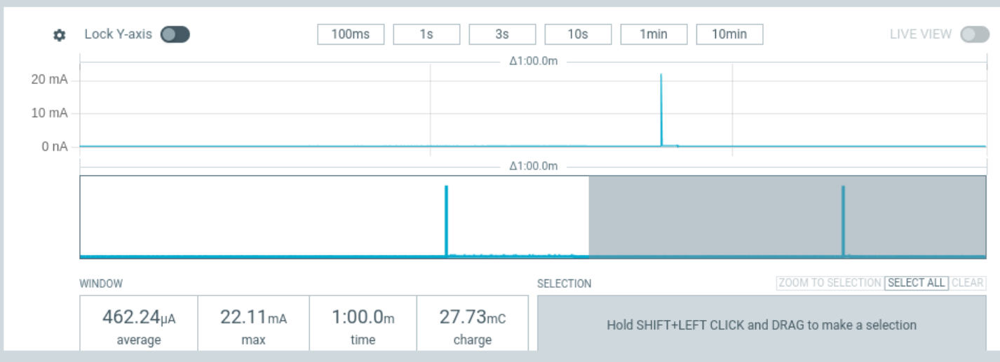
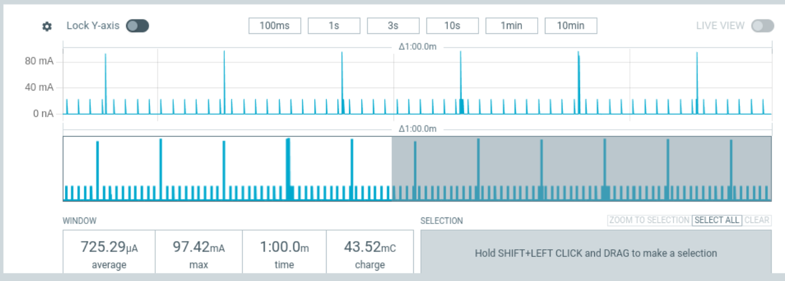
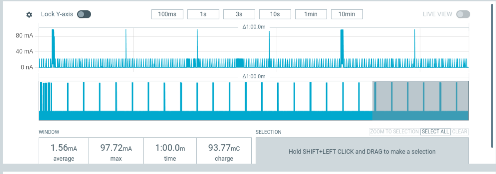
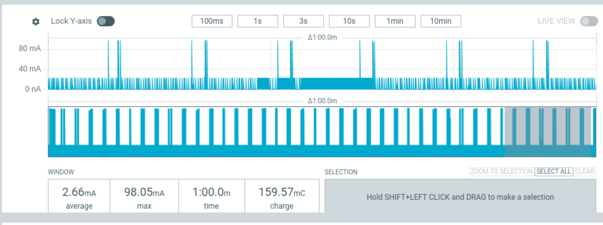

# Power Management Testing of esp32-h2 Super Mini
Testing the external power_management component under multiple yaml configurations using the Nordic Semiconductor Power Profiler Kit II (PPK2)

* Test Date 2026-02-18
* EspHome Version: 2026.3.0-dev20260218
* DUT: esp32-h2 Super Mini - ESP32-H2 (revision v0.1)
* DUT Features: BT 5 (LE), IEEE802.15.4, Single Core, 96MHz, Crystal frequency:  32MHz

## Initial Test
The initial test to establish a baseline power profile over a 1 minute band.

```yaml
external_components:
  # [power_management] new component that enables power management for esp_idf
  - source: github://pr#12325
    components: [power_management]
    refresh: 1h
  # [openthread] Provide action to control radio on/off when poll_period > 0
  - source: github://pr#11766
    components: [openthread]
    refresh: 1h

esphome:
  name: test-esp32h2-2
  friendly_name: Test ESP32H2 2

esp32:
  board: esp32-h2-devkitm-1
  variant: ESP32H2
  flash_size: 4MB
  framework:
    type: esp-idf
    log_level: NONE
    sdkconfig_options:
      CONFIG_RTC_CLK_SRC_INT_RC: "n"
      CONFIG_RTC_CLK_SRC_EXT_CRYS: "y"
      CONFIG_OPENTHREAD_LOG_LEVEL_DYNAMIC: "n"
      CONFIG_OPENTHREAD_LOG_LEVEL_NONE: "y"

logger:
  level: NONE

power_management:
  enable_light_sleep: true
  power_down_flash: true
  power_down_peripherals: true

network:
  enable_ipv6: true
```
Test results in an average amperage of ~.5mA.  A pulse to 20mA occurs once per minute and is caused by the preferences component waking the chip up to store preferences in NVS.



## Add Open Thread Test
Add openthread component configure for Sleepy End Device at a poll_period of 10seconds.
Switch added for later use with api and mqtt to make it easier to access chip and is "OFF" for all testing

```yaml
openthread:
  device_type: mtd
  tlv: !secret openthread_tlv
  poll_period: 10sec

switch:
  - platform: template
    name: "Radio Always On"
    optimistic: true
    restore_mode: ALWAYS_OFF
    turn_on_action:
      then:
        - logger.log: "Radio Always On"
        - openthread.radio: true
    turn_off_action:
      then:
        - logger.log: "Radio Off When Idle"
        - openthread.radio: false
```

Test results in an average amperage of ~.75mA.  A pulse to 20mA occurs once per second and is sourced in openthread task generating a 1 second timer, further research
needed to determine if there is a configuration of openthread that would stop this wakeup.



## Add API Test
Add api component

```yaml
api:
  encryption:
    key: !secret api_encryption_key
```

Test results in an average amperage of ~1.6mA.  Pulses to 20mA occur frequently around 5-7 times per second with short bursts to higher occurance happening at least once per minute, further research
needed to determine why api component is causing these wakeups.



## Remove API, Add MQTT Test
Remove api component and add mqtt component

```yaml
mqtt:
  broker: 192.168.1.25
  username: !secret mqtt_user
  password: !secret mqtt_password
```

Test results in an average amperage of ~2.7mA.  Pulses to 20mA occur frequently with short bursts to higher occurance happening, further research
needed to determine why mqtt component is causing these wakeups.



