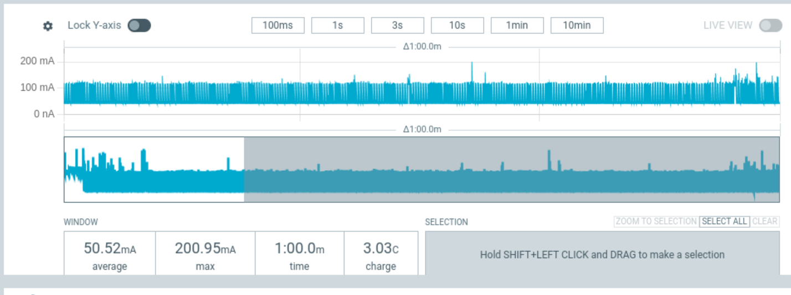
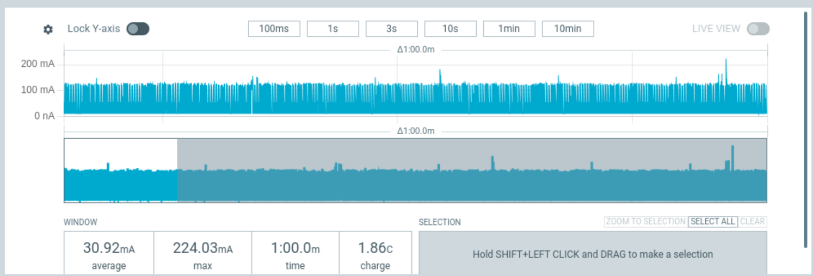

# Power Management Testing of esp32 DevKit
Testing the external power_management component under multiple yaml configurations using the Nordic Semiconductor Power Profiler Kit II (PPK2)

* Test Date 2026-02-18
* EspHome Version: 2026.3.0-dev20260218
* DUT: esp32 devkit - ESP32-D0WD-V3 (revision v3.1)
* DUT Features: Wi-Fi, BT, Dual Core + LP Core, 240MHz, Vref calibration in eFuse, Coding Scheme None, Crystal Frequency: 40MHz
* Power Supply: 3.3V pin

## No Power Management Test
The initial test to establish a baseline power profile over a 1 minute band without power_management.

```yaml
external_components:
  # [power_management] new component that enables power management for esp_idf
  - source: github://pr#12325
    components: [power_management]
    refresh: 1h

esphome:
  name: test-esp32-1
  friendly_name: Test ESP32 1

esp32:
  variant: esp32
  framework:
    type: esp-idf
    log_level: INFO
    advanced:
      minimum_chip_revision: "3.1"

logger:
  level: NONE

network:
  enable_ipv6: true

wifi:
  fast_connect: true
  ssid: !secret wifi_ssid
  password: !secret wifi_password

api:
  encryption:
    key: !secret api_encryption_key
```
Test results in an average amperage of ~50mA.



## Add Power Management Test
Add power_management component

```yaml
power_management:
  enable_light_sleep: true
  power_down_flash: true
  power_down_peripherals: false
```

Test results in an average amperage of ~30mA. 


